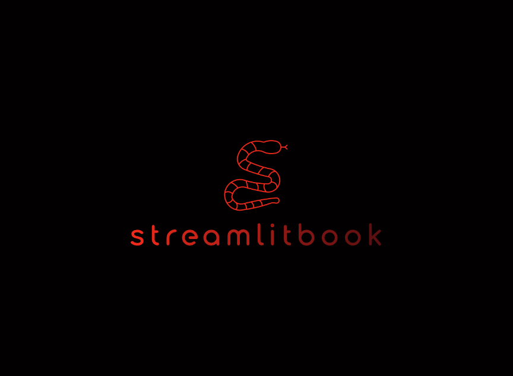

<div id="top"></div>

<!-- PROJECT LOGO -->
<br />
<div align="center">
  <a href="https://github.com/BexTuychiev/streamlitbook">
    
  </a>

<h1 align="center">StreamlitBook</h1>

  <p align="center">
    Convert any Jupyter Notebook to identical Streamlit web apps and make your ML apps even more awesome.
  </p>
</div>


<!-- TABLE OF CONTENTS -->
<details>
  <summary>Table of Contents</summary>
  <ol>
    <li>
      <a href="#about-the-project">About The Project</a>
      <ul>
        <li><a href="#built-with">Built With</a></li>
      </ul>
    </li>
    <li>
      <a href="#getting-started">Getting Started</a>
      <ul>
        <li><a href="#installation">Installation</a></li>
      </ul>
    </li>
    <li><a href="#usage">Usage</a></li>
    <li><a href="#roadmap">Roadmap</a></li>
    <li><a href="#contact">Contact</a></li>
  </ol>
</details>


<!-- ABOUT THE PROJECT -->

## About The Project <small id='about-the-project'></small>



In recent years, building machine
learning applications with Streamlit became so much popular. The apps were awesome but
I noticed they lacked a key ingredient to make them even better.

Streamlit apps were, simply, apps - a web page to showcase dashboards, try out models,
etc.
But those apps lacked a way to share how their creators built them and what their
approaches were. Even if the creators wanted to do that, they had to turn to crude methods
like linking to external links or docs where they outlined their approach.

My idea was that developers should be able to do that right in the app itself. The process
should be simple and require as little code as possible. And thus StrimlitBook was born.

StrimlitBook is an API that allows you to convert Jupyter Notebooks to identical
Streamlit components which you can embed right into your scripts where you build your
Streamlit apps.

Check out the getting started and usage sections for more details.

P.S. the project is still in development. But you can expect a PyPI release early next
year (2023).

> Someone stole the name `streamlitbook` before I could publish the package on PyPI, so I changed the name to `strimlitbook`.

<p align="right">(<a href="#top">back to top</a>)</p>

### Built With <small id='built-with'></small>

* [Jupyter](https://jupyter.org/)
* [Streamlit](https://streamlit.io/)

<p align="right">(<a href="#top">back to top</a>)</p>


<!-- GETTING STARTED -->

## Getting Started <small id='getting-started'></small>

As the project is still in local development, you can only try out the project via
cloning. Here are the instructions:

### Installation <small id='installation'></small>

```bash
git clone https://github.com/BexTuychiev/strimlitbook.git
pip install -r requirements.txt
```

<p align="right">(<a href="#top">back to top</a>)</p>

<!-- USAGE EXAMPLES -->

## Usage <small id='usage'></small>

To see your notebook as an app, simply paste this line of code into the script of your
Streamlit app:

```python
from strimlitbook import read_ipynb

nb = read_ipynb('path/to/your/notebook.ipynb')
nb.display()
```


<p align="right">(<a href="#top">back to top</a>)</p>


<!-- ROADMAP -->

## Roadmap <small id='roadmap'></small>

I am planning the initial release of the package on PyPI in late 2023.
After the initial release, I have got fantastic things planned for the library. Apart from
many tiny quality-of-life features I am adding, my ultimate aim is to make the project a
drop-in replacement
to [the Jupyter Book project](https://jupyterbook.org/en/stable/intro.html).

I am thinking
that combining the awesome features and theme of Streamlit with StrimlitBook's notebook
parser can completely revolutionalize the way e-books are built as authors would have
ultimate flexibility to make them as interactive as possible using Python logic right in
the middle of a book page.

I am very passionate about this aim, and I am slowly working towards realizing it.
<p align="right">(<a href="#top">back to top</a>)</p>

<!-- CONTACT -->

## Contact <small id='contact'></small>

Your Name - [@BexTuychiev](https://www.linkedin.com/in/bextuychiev/) -
bex@ibexprogramming.com

Project
Link: [https://github.com/BexTuychiev/streamlitbook](https://github.com/BexTuychiev/streamlitbook)

<p align="right">(<a href="#top">back to top</a>)</p>
